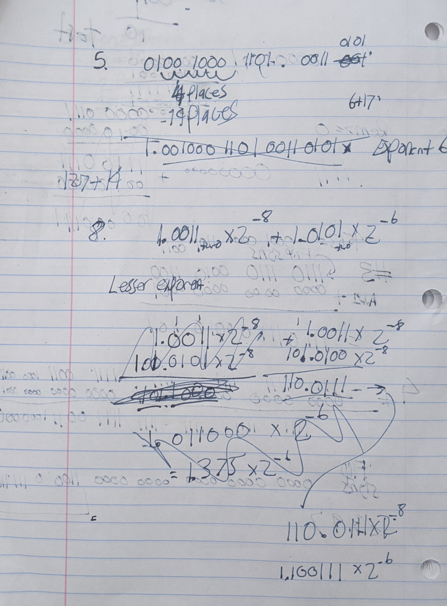

# Assignment 8
### Fall 2020: CSE230 Computer Organization
### Author: Austin Derbique

## Disclaimer
The following text shall not be used for the purposes of academic dishonesty. It is granted only for educational & archival purposes, not to be used by other students enrolled in a computer organization class for the purposes of receiving academic credit. This information is not guaranteed to be correct. Please consult the textbook [Computer Organization and Design: Fifth Edition](https://www.amazon.com/Computer-Organization-Design-MIPS-Architecture/dp/0124077269) for up to date and accurate information.

# Exercises 

## Exercise 1 (2pts)
### Prompt
Perform a multiplication of two binary numbers (multiplicand 0110 and multiplier 0110) by creating a table to show steps taken, multiplicand register value, multiplier register value, and product register value for each iteration by following the steps described in the following document. (Points will be deducted if steps are not shown.)  
[Read this steps](docs/hw8mult.pdf)  
You can use this table to start [hw8_1.pdf](docs/hw8_1.pdf)

### Response

The multiplication of `0110 base 2 * 0110 base 2`, also known as `6 base 10 * 6 base 10` can be illustrated in the following steps

|Iteration|Step|Multiplicant Register Value|Multiplier Register Value|Product Register Value|
|---------|----|---------------------------|-------------------------|----------------------|
|0|Initial Values|0110|0110|0|
|1|1a Prod=Prod+multiplicand, 2=sll by 1, 3=srl by 1|01100|011|0+01100=01100|
|2|1a Prod=Prod+multiplicand, 2=sll by 1, 3=srl by 1|011000|01|01100+011000=100100|
|3|1a Prod=Prod+multiplicand, 2=sll by 1, 3=srl by 1|0110000|0|100100|
|4|2=sll by 1, 3=srl by 1|01100000|-|100100|

The final answer is: `00100100 base 2`, or `36 base 10`. 

## Exercise 2 (2pts)
### Prompt
Perform a division of two binary numbers (divide 0011 0110 by 0110) by creating a table to show steps taken, quotient register value, divisor register value, and remainder register value for each iteration by following the steps described in the following document. (Points will be deducted if steps are now shown.)  
[Read these steps](docs/hw8div.pdf)  
You can use this table to start: [hw8_2.pdf](docs/hw8_2.pdf)

### Response
The division of `0011 0110 base 2 / 0110 base 2`, also known as `54 base 10 / 6 base 10` can be illustrated in the following steps:
|Iteration|Step|Quotient|Divisor|Remainder|
|---------|----|--------|-------|---------|
|0|Initial Value|0000|01100000|00110110|
|1|1: Rem-=Div,2b: R<0 Rem+=Div, sll Q, Q0=0, 3: srl Div|0000|00110000|00110110|
|2|1: Rem-=Div,2a: R>=0 sll Q, Q0=1,3: srl Div|0001|00011000|00000110|
|3|1: Rem-=Div,2b: R<0 Rem+=Div, sll Q, Q0=0|0010|00001100|00000110|
|4|1: Rem-=Div,2b: R<0 Rem+=Div, sll Q, Q0=0|0100|00000110|00000110|
|5|1: Rem-=Div,2a: R>=0 skk Q, Q0=1,3: srl Div|1001|00000011|00000000|

The final answer is `00001001 base 2`, or `9 base 10`.  
**Note:** Complete intermediate steps are available in the `Work By Hand` section of this document. The table above shows the result of each iteration.

## Exercise 3 (2pts)
### Prompt
Convert -4563 base 10 into a 32-bit two's complement binary number.

### Response

1. Convert `4563 base 10` to binary. The result is `0001 0001 1101 0011`.
2. Now, to take the two's complement, take the inverse of `0001 0001 1101 0011` and the result is `1110 1110 0010 1100`.
3. Add `1`. `0000 0000 0000 0001 base two + 1110 1110 0010 1100 base two`,

The final answer in 32 bit is `1111 1111 1111 1111 1110 1110 0010 1101 base two` binary signed two's complement.

## Exercise 4 (2pts)
### Prompt
What decimal number does this two's complement binary number represent: `1111 1111 1111 1111 1111 0011 1000 0011 base 2`?

### Reponse

1. Subtract `0000 0000 0000 0000 0000 0000 0000 0001 base two` from `1111 1111 1111 1111 1111 0011 1000 0011 base two`. This yields `1111 1111 1111 1111 11111 0011 1000 0010 base two`
2. Flip the signs of `1111 1111 1111 1111 1111 0011 1000 0010 base two`. This yields `0000 0000 0000 0000 0000 0000 1100 0111 1101 base two`.
3. Convert `0000 0000 0000 0000 0000 0000 1100 0111 1101 base two` to base ten, also known as decimal.

The final answer is `-3197 base 10` or `-3197`.

## Exercise 5 (2pts)
### Prompt
What would the number `18653.4140625` base ten be in IEEE 754 single precision floating point format? You need to follow the following steps:
1. Write the above number in binary. (before normalizing it)
2. Write the above number in the normalized format.
3. Compute the biased exponent, and write it in binary.
4. Write its IEEE 754 single precision floating point format in binary, then in hex. (using 8 hex numbers)

### Response
1. Converting `18653.4140625 base ten` to binary yields `0100 1000 1101 1101 . 0110 1010 base two`
2. The normalized format is `1.0010 0011 0111 0101 1010 1000 base 2 * 10^14 base 10`.
3. The biased exponent is `14 + 127 = 141 base 10` or `1000 1101 base 2` binary.
4. Combine the sign (`0`), biased exponent (`1000 0101`), and mantissa (`0010 0011 0111 0101 1010 100`)   

The final answer is `0 10001101 00100011011101011010100`

Converting to hex, we take `0100 0110 1001 0001 1011 1010 1101 0100 base 2` which yields a result of `0x46BB12D4 base 16`.

## Exercise 6 (2pts)
### Prompt
What would the number `-18472.40625` base ten be in IEEE 754 single precision floating point format?
1. Write the above number in binary. (before normalizing it)  
2. Write the above number in the normalized format.   
3. Compute the biased exponent, and write it in binary. 
4. Write its IEEE 754 single precision floating point format in binary, then in hex. (using 8 hex numbers)

### Repsonse
1. Converting `-18472.40625 base 10` to binary yields `-100 1000 0010 1000.0110 1`
2. The normalized format is `-1 . 0010 0000 1010 0001 1010 base two * 2^14 base 10`.
3. The biased exponent is `14 + 127 = 141 base 10` or `1000 1101 base 2` binary.
4. Combine the sign (`1`), biased exponent (`1000 1101`), and mantissa (`0010 0000 1010 0001 1010`)

The result in binary is `1 10001101 00100000101000011010000`.

Converting to hex, we take `1100 0110 1001 0000 0101 0000 1101 0000 base 2` which yields a result of `0xc69050d0 base 16`. 

## Exercise 7 (2pts)
### Prompt
What decimal number would be the IEEE 754 single precision floating point number `0xC5A3B760` be? Write your final answer in scientific notation as `m x 10^p` where `p` is an integer.

### Response

1. Converting the hexidecimal number `0xC5A3B760` to binary yields `1100 0101 1010 0011 1011 0111 0110 0000`.
2. Breaking this value into parts yields the sign, biased exponent, and mantissa. This is `1 10001011 0100 0111 0110 1110 1100 000`.\
3. The sign `1` is negative, the biased exponent `10001011 base 2` is `139 base 10` turned normal exponent is `139-127=12 based 10`. The mantissa is `0100 0111 0110 1110 1100 000 base 2`.
4. The normalized format would be `-1.0100 0111 0110 1110 1100 000 base 2 * 10^12 base 10`. Finally, convert to decimal.
5. `0*2^-1+ 1*2^-2 + 0*2^-3 + 0*2^-4 + 0*2&-5 + ...` yields

The final answer is `-5.238921875 * 10^3 base 10`.

## Exercise 8 (2pts)
### Prompt
For this problem, assume 5 bits precision. Add two binary numbers, `1.0011 base two x 2^(-8)` and `1.0101 base two x 2^(-6)` showing the following steps:
1. The significand of the number with the lesser exponent is shifted right to match the exponent of the larger number.
2. Add the significands. (You can assume that you can carry all digits)
3. Normalize the sum and check for an overflow or an underflow.
4. Truncate the sum (using 5 bits precision.)

### Reponse
1. Shift the lesser exponent to match the larger exponent. `1.0101 base 2 * 2^-6` becomes `0.010011 * 2^-6`.
2. Add the significands `(0.010011 base two * 2^-6) + (1.010100 base two & 2^-6)`) which results in `1.100111 base two * 2^-6`.
3. In this case, the num is already normalized. The exponent `-6` will not cause an underflow or overflow.
4. Finally, truncate the sum.

The final answer is `1.1001 base two * 2^-6`.

## Exercise 9 (2pts)
### Prompt
For this problem, assume 5 bits precision. Multiply binary two binary numbers, `1.0011 base two x 2^(-8)` and `1.0101 base two x 2^(-6)` showing the following steps:
1. Adding the exponent without bias.
2. Multiply the significands. (You can assume that you can carry all digits)
3. Normalize the product and check for an overflow or an underflow.
4. Truncate the product (using 5 bits precision.) 

### Response
1. Adding the exponents together without bias `(-8)+(-6)=-14`.
2. Multiplying the significands `1.0011 base two * 1.0101 base two` yields a result of `1.10001111`.
3. Normalizing the product gives the result `1.1000 1111 * 2^-14`. In this case, the value of the exponent (`113 dec`) is withing bounds, so there is no underflow or overflow.
4. Truncate the normalized number to 5 bits precision yields the final result.

The final answer is `1.1000 base two * 2^-14`.

## Exercise 10 (2pts)
### Prompt
Add `8.96 base ten x 10^10` to `6.78 base ten x 10^8`, assuming the following two different ways:
1. You have only three significant digits, first with guard (2 digits) and round digits.
2. You have only three significant digits without guard and rounding.

### Reponse
#### With Guard Digits
1. First, shift smaller exponent to match. `6.78 * 10^8` becomes `0.0678 * 10^10`.
2. Add significands. `8.96 + 0.0678 = 9.0287`.
3. Normalize the result to `9.0287 * 10^10`.
4. Round to the nearest three significant digits.

The final answer is `9.03 * 10^10`.

#### Without Guard Digits
1. First, shift smaller exponent to match. Because there is no guard digit, the number is instantly rounded. `6.78 * 10^8` becomes `0.07`.
2. Add significands. `8.96 + 0.0678 = 9.02`.
3. Normalize the result to `9.02 * 10^10`.
4. Round to the nearest three significant digits.

The final result is `9.02 * 10^10`.

## Work by Hand

