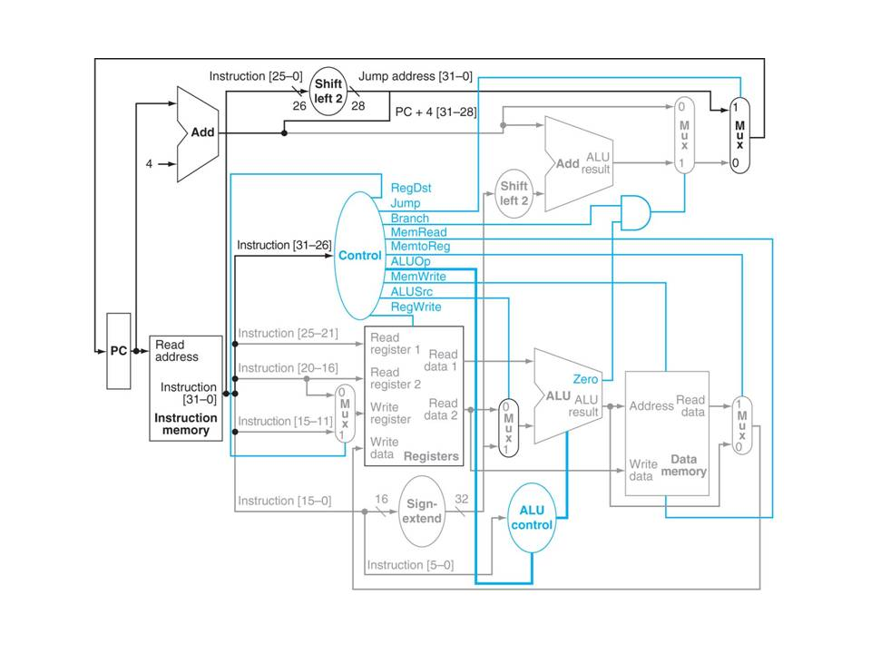

# Assignment 9
### Fall 2020: CSE230 Computer Organization
### Author: Austin Derbique

## Disclaimer
The following text shall not be used for the purposes of academic dishonesty. It is granted only for educational & archival purposes, not to be used by other students enrolled in a computer organization class for the purposes of receiving academic credit. This information is not guaranteed to be correct. Please consult the textbook [Computer Organization and Design: Fifth Edition](https://www.amazon.com/Computer-Organization-Design-MIPS-Architecture/dp/0124077269) for up to date and accurate information.

# Exercises 

## Exercise 1 (1pt)
### Prompt
Suppose you wish to run a program `P` with `41.5 x 109` instructions on a `20 GHZ` machine with a CPI of `0.85`. What is the expected CPU time to execute this program on this machine?
### Response
Using the formula `CPU Time = I x CPI x T`, where `I` is the number of instructions, `CPI` is the cycles per instruction, and `T` which is the clock speed.
- CPU Time = (41.5 x 109) x (0.85) x (20 x 10-9)
- CPU Time = `1.76 seconds`

## Exercise 2 (6pts)
### Prompt
Consider two different implementations, `I1` and `I2`, of the same instruction set. There are three classes of instructions `(A, B, and C)` in the instruction set. `I1` has a clock rate of `4GHZ`, and `I2` has a clock rate of `5GHZ`. The average number of cycles for each instruction class on `I1` and `I2` is given in the following table:
|Class|CPI on I1|CPI on I2|C1 Usage|C2 Usage|C3 Usage|
|-----|--------------------|--------------------|-------------------|-------------------|-------------------|
|A|4|2|35%|25%|15%|
|B|3|4|40%|30%|50%|
|C|1|2|25%|45%|35%|

The table also contains a summary of average proportion of instruction classes generated by three different compilers, `C1`,`C2`,`C3`. Assume that each compiler uses the same number of instructions for a given program but that the instruction mix is as described in the table.

#### A
Using `C1`, compute the averate CPI for each of `I1` and `I2`. Then compute the speed, that is the average number of instructions per second for each of `I1` and `I2`. Then decisde which one is faster than the other? and in what ratio?  

#### B
Using `C2`, compute the averate CPI for each of `I1` and `I2`. Then compute the speed, that is the average number of instructions per second for each of `I1` and `I2`. Then decisde which one is faster than the other? and in what ratio?  

#### C
Using `C3`, compute the averate CPI for each of `I1` and `I2`. Then compute the speed, that is the average number of instructions per second for each of `I1` and `I2`. Then decisde which one is faster than the other? and in what ratio?  

#### D
If you purchased `I1`, which compiler has a better performance than the others?  

#### E
If you purchased `I2`, which compiler has a better performance than the others?  

#### F
Which combination of computer and compiler has the best performance if all other criteria were identical, including cost?

### Response

#### A
Average CPI `I1`: `4 x 0.35 + 3 x 0.4 + 1 x 0.25 = 2.85` cycles per instruction    
Average CPI `I2`: `2 x 0.35 + 4 x 0.4 + 2 x 0.25 = 2.8` cycles per Instruction    
Average Speed `I1`: `4 x 109 / 2.85 = 1.4 x 109` instructions per second  
Average Speed `I2`: `5 x 109 / 2.8 = 1.79 x 109` instructions per second  
Relative Speed: `1.79 / 1.4 = 1.28`. Therefore, I2 is `28%` faster than I1.  

#### B
Average CPI `I1`: `4 x 0.25 + 3 x 0.3 + 1 x 0.45 = 2.35` cycles per instruction    
Average CPI `I2`: `2 x 0.25 + 4 x 0.3 + 2 x 0.45 = 2.6` cycles per Instruction    
Average Speed `I1`: `4 x 109 / 2.35 = 1.70 x 109` instructions per second  
Average Speed `I2`: `5 x 109 / 2.6 = 1.92 x 109` instructions per second  
Relative Speed: `1.92 / 1.70 = 1.13`. Therefore, I2 is `13%` faster than I1.

#### C
Average CPI `I1`: `4 x 0.15 + 3 x 0.5 + 1 x 0.35 = 2.45` cycles per instruction    
Average CPI `I2`: `2 x 0.15 + 4 x 0.5 + 2 x 0.35 = 3.00` cycles per Instruction    
Average Speed `I1`: `4 x 109 / 2.45 = 1.63 x 109` instructions per second  
Average Speed `I2`: `5 x 109 / 3.00 = 1.67 x 109` instructions per second  
Relative Speed: `1.67 / 1.63 = 1.02`. Therefore, I2 is `2%` faster than I1.

#### D
Compiler 2 has the best performance for I1, as it has the highest instructions per second speed.

#### E
Compiler 2 has the best performance for I2, has it has the highest instructions per second speed.

### F
Computer I2 with Compiler 2 has the best performance.

## Exercise 3 (3pts)
### Prompt
Determine which MIPS assembly instructions if any, that we discussed in class (R-format (including add, sub, or, and nor, slt), lw, sw, beq, j) will not work correctly and explain what will happen instead, if each of the following control signals in the single-cycle datapath that we saw in class (shown below) is alweays stuck at one value specified below:

#### A
ALUSrc = 1 (always stuck at 1)

#### B
Branch = 1 (always stuck at 1)

#### C
ALUOp0 = 1 (always stuck at 1)

### Response

## Exercise 4 (2pt)
### Prompt
### Response

## Exercise 5 (2pt)
### Prompt
### Response
